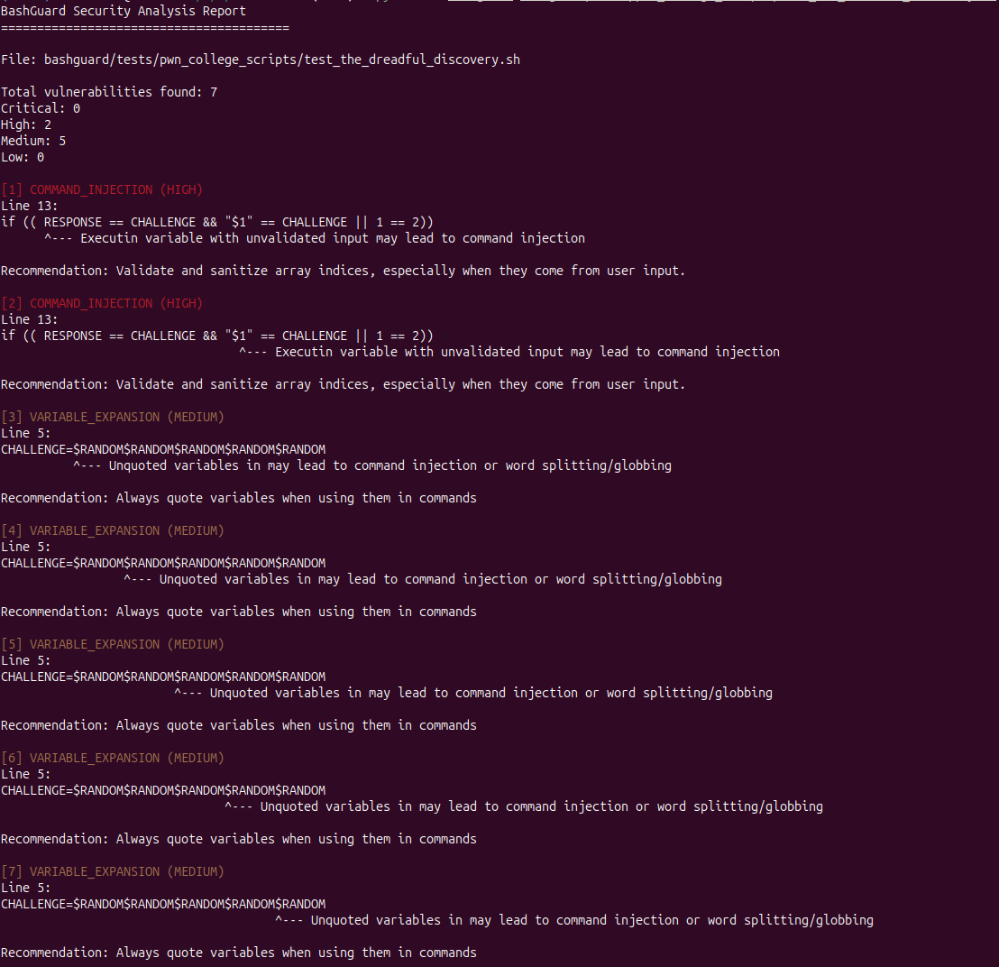

# Bash-Guard

A Python-based static analysis tool for Bash scripts that detects security issues (command injection, unsafe variable/parameter expansion, PATH misuse) and optionally suggests safe fixes if possible.

### What it does
- Detects command injection patterns, including variables executed as commands, `eval`/`source` misuse, array index attacks.
- Flags unsafe variable expansion and unquoted variable assignments that can cause globbing.
- Highlights PATH misuse by detecting scripts that don’t explicitly define a safe `PATH`.
- Runs ShellCheck first to surface syntax errors and key quoting issues, then proceeds with further security analysis.
- Outputs human-readable colorized text or JSON reports; can auto-fix a subset of issues.

### How it works (pipeline)
1. Pre-check: Invokes ShellCheck and stops early on syntax errors to avoid noisy results.
2. Parsing: Uses Tree-sitter (using bash grammar) to build an AST and extract commands, variables, assignments, subscripts, and test expressions.
3. Tainted variables and context tracking: Tracks user-influenced data sources (read input, positional parameters, selected environment variables, command substitution), including function-local scopes.
4. Analyzers: Runs specialized analyzers for environment, parameter expansion, variable expansion, and command injection; recursively inspects strings executed by `bash -c`/`sh -c`, `eval`, and `source`.
5. Deduplication and prioritization: Merges overlapping findings and prioritizes command injection over related expansion issues on the same line.
6. Reporting and fixing: Generates text/JSON reports; optional fixers apply targeted quoting for known classes (e.g., unquoted variables and command substitution).

### Vulnerabilities covered
- Command Injection:
  - Detects variables used as commands, including tainted ones and positional parameters.
  - Flags `eval`/`source` when fed tainted inputs; recursively parses executed strings.
  - Inspects `bash -c`/`sh -c` arguments by re-parsing their inner command strings.
  - Identifies array index attacks by tracking subscripts and user-controlled indices; includes an check that executes a safe, isolated script to verify exploitability of "superweapon" patterns in test/arithmetic contexts.

- Variable Expansion:
  - Finds unquoted variable uses via AST, including expansions inside assignments.
  - Includes ShellCheck warnings for classic quoting issues.

- Environment (PATH misuse):
  - Scans assigned variables and flags scripts that do not explicitly set `PATH`.

- Parameter Expansion:
  - Detects use of the 0-th positional parameter expansion and flags it for potential race condition (symlinks) scenarios.

### Technology stack
- Python
- Tree-sitter (bash)
- ShellCheck
- Pytest

### Installation
1. Ensure ShellCheck is installed and in PATH.
2. Create a virtual environment and install Python dependencies from `requirements.txt`.

### Usage
- CLI: `python -m bashguard <script.sh>`
- Options: `--format {text,json}`, `--output <report>`, `--verbose`, `--fix`, `--fix-output <file>`

### Architecture overview
- analyzers: individual analyzers for environment, parameter/variable expansion, command injection, and ShellCheck integration.
- core: AST parser (Tree-sitter), types/models, base classes, logger, vulnerability model, and reporter (text/JSON).
- fixers: targeted automatic fixers for unquoted variable usage and unquoted command substitution.
- tests and demos: curated vulnerable and safe scripts with pytest coverage.

# Sample Report
